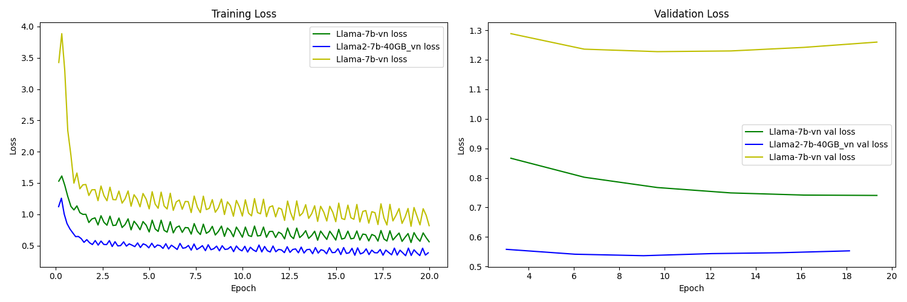

#  llama-v1

This project is part of the TF07 Course offered by ProtonX. We are utilizing the LoRA  to fine-tune the LLaMA-base Large Language Model using Vietnamese datasets.

## Prerequisition

Before using this project, please make sure you have registered for a Hugging Face API token. The Hugging Face token is required to access certain resources and authenticate with Hugging Face services.
huggingface-cli login
```bash
huggingface-cli login --token $HUGGINGFACE_TOKEN
```
## Installation

```bash
$ pip install -r requirements.txt
```
## Datasets

This repository combined some vietnamese datasets:

1. `alpaca_translate_GPT_35_10_20k.json`: Translate by [VietnamAIHub/Vietnamese_LLMs](https://github.com/VietnamAIHub/Vietnamese_LLMs)

## Finetuned Models

Below is a table of our Finetuned models, detailing the LoRA configurations, and links to access each model.

| Base Model |  LoRA Config | Finetuned Model   |
|------------|-------------|---------------|
|   [huggyllama/llama-7b](https://huggingface.co/huggyllama/llama-7b)   |  8-bit precision     | [CallMeMrFern/Llama-7b-vn](https://huggingface.co/CallMeMrFern/Llama-7b-vn) |
| [vietnamese-llama2-7b-40GB](https://huggingface.co/bkai-foundation-models/vietnamese-llama2-7b-40GB)     | 8-bit precision     | [CallMeMrFern/Llama2-7b-40GB_vn](https://huggingface.co/CallMeMrFern/Llama2-7b-40GB_vn) |
|  [Llama-2-7b-chat-hf](https://huggingface.co/meta-llama/Llama-2-7b-chat-hf)     |  8-bit precision     | [CallMeMrFern/Llama-2-7b-chat-hf_vn](https://huggingface.co/CallMeMrFern/Llama-2-7b-chat-hf_vn) |

Here are the experiment results using the specified models:




## Finetune

1. Single gpus training:

    ```bash
    $ python finetune/lora.py \
    --base_model meta-llama/Llama-2-7b-chat-hf \
    --model_type llama \
    --data_dir data/general/alpaca_translate_GPT_35_10_20k.json \
    --output_dir finetuned/meta-llama/Llama-2-7b-chat-hf \
    --lora_target_modules '["q_proj", "v_proj"]' \
    --micro_batch_size 1
    ```

2. Distributed training on Multi-GPUs

    ```bash
    $ torchrun --standalone --nnodes=1 --nproc_per_node=2 finetune/lora.py \
    --base_model meta-llama/Llama-2-7b-chat-hf \
    --model_type llama \
    --data_dir data/general/alpaca_translate_GPT_35_10_20k.json \
    --output_dir finetuned/meta-llama/Llama-2-7b-chat-hf \
    --lora_target_modules '["q_proj", "v_proj"]' \
    --micro_batch_size 1
    ```
## Inference

1.  local log file
    ```bash
    $ python inference/run_exp.py \
    --base_model meta-llama/Llama-2-7b-chat-hf \
    --model_type llama \
    --data_dir data/general/alpaca_translate_GPT_35_10_20k.json \
    --output_dir finetuned/meta-llama/Llama-2-7b-chat-hf \
    --log_dir ./inference/local.log
    ```
2. gradio interface
    ```bash
    $ python inference/ui.py \
    --base_model meta-llama/Llama-2-7b-chat-hf \
    --model_type llama \
    --output_dir finetuned/meta-llama/Llama-2-7b-chat-hf
    ```
## Reference 
- Implementing LoRa Library: https://github.com/huggingface/peft
- Fine-tuning Instruction Dataset Tutorial: [tloen/alpaca-lora](https://github.com/tloen/alpaca-lora) 


## **Authors:**
- Daniel Du (danghoangnhan)
    - Github: https://github.com/danghoangnhan
    - Linkedin: https://www.linkedin.com/in/daniel-du-4734081b8/
    - Email: danghoangnhan.1@gmail.com
  
## **Advisors:**
- Nguyen Ba Ngoc
    - Github: https://github.com/bangoc123
    - Linkedin: https://www.linkedin.com/in/nbangoc
    - Email: protonxai@gmail.com